# Analyzing YouTube Trending Videos in 2019

Around 1.5 years ago, a few months after entering the data-science field, I did an analysis of YouTube trending videos in US. That analysis was performed on trending videos of some months in 2017 and 2018; 40,000 videos were analyzed. The analysis attracted some interest on Kaggle and Reddit; I also received some emails praising the work done. That was 1.5 years age.

Today, I present an improved and expanded version of that analysis. This analysis is more advanced and contains new and interesting elements. Also, this time the analysis will cover more countries, not just the US.

## What are YouTube Trending Videos?

YouTube is the most popular and most used video platfrom in the world today. YouTube has [a list of **trending videos**](https://www.youtube.com/feed/trending). I'll quote the description of trending videos from [YouTube itself](https://support.google.com/youtube/answer/7239739?hl=en):

> Trending helps viewers see what’s happening on YouTube and in the world. Trending aims to surface videos that a wide range of viewers would find interesting. Some trends are predictable, like a new song from a popular artist or a new movie trailer. Others are surprising, like a viral video. Trending isn't personalized and displays the same list of trending videos in each country to all users.
>
> The list of trending videos is updated roughly every 15 minutes. With each update, videos may move up, down, or stay in the same position in the list.

## Goals of the Analysis

The main goal of the analysis is to find interesting facts and patterns by exploring the data and by using effective visualizations.

The analysis aims to explore the following:

- Among all the trending videos in 2019, which videos have the maximum view count (top 3 videos)?
- What is the average/minimum/maximum view count for 2019's trending videos?
- Which videos appeared on the trending list the most (because some videos might appear on the trending list for more than one day)? 
- What percentage of trending videos have their titles fully uppercase?
- How many videos contain 1 uppercase word? 2 uppercase words? 3 uppercase words?...
- XXpercentage of title-case titles
- What are the most common words in the titles of trending videos?
- What are the most common symbols in the titles of trending videos?
- What are the most common emojis in the titles of trending videos?
- What are the most common bigrams (2 consecutive words) in the titles of trending videos?
- What are the title lengths of the trending videos? What is the average/minimum/maximum title length? Which videos have the minimum title length?
- Which channels have more trending videos than others (top 10 channels)?
- What are the top categories of trending videos? Are "Entertainment" videos more trending than "Gaming" videos for example?
- At what times of the day were the trending videos published? Were more trending videos published in day hours or night hours? XXUTC
- How many views/comments/likes trending videos have when first appearing on the trending list?
- Trending videos that have their dislikes more than their likes when first appearing on the trending list
- How many days are between publishing a video and its first appearance on the trending list?
- How long are the descriptions/tags of trending videos?
- What are the most common words in the descriptions/tags of trending videos?
- What are the most used colors in the thumbnails of trending videos? (Analysis of the thumbnails of all trending videos)
- How hashtags are used in trending-videos descriptions?
- What are the most common objects in the thumbnails of trending videos? (Running AI object detection algorithm on all thumbnails)

## Tools Used

This analysis was performed using Python and a powerful group of Python libraries including Pandas, Matplotlib, NLTK, ImageAI, WordCloud, and more.

The analysis were performed in a Jupyter Notebook (particularly, in Jupyter Lab).

## Data Source

The data used in this analysis was retrieved from YouTube API. A script was written to run each day throughout 2019 and fetch data from YouTube API about the trending videos of that day (for many countries). The script would then process the data received from YouTube and store them in text files.

The script is not my work. It can be found on Github: [ Trending-YouTube-Scraper](https://github.com/mitchelljy/Trending-YouTube-Scraper).

I put the script on a AWS EC2 instance and scheduled it—using Crontab—to run every day at a specific time.

After 2019 ended, I connected to the AWS instance using FileZilla application and downloaded all the data produced by the script. There was a file for each country for each day of 2019. I fetched data for 20 countries. So as a result, I downloaded 7,300 files.

To perform the analysis, I needed to process the data in order to merge the files for each country into a single CSV file.

## Data Size and Description

**In this post, United-States trending videos will be analyzed**, which constitute a total of 72,994 videos. YouTube usually place 200 videos in the trending list each day which would mean that we should have 73,000 (365 x 200) videos. We have 72,994. This is probably because on a few days, the number of Trending videos was slightly less than 200. 

So **we have data on 72,994 trending videos to analyze**. On YouTube, the same video might appear on the trending list for many days. This means that the 72,994 videos are not unique videos. In fact, among the 72,994 videos, we have **11,177 unique videos**. 

In other words, 11,177 videos showed on the trending list throughout 2019. Some of them might have stayed on the list for 10 days, some for 20 days, etc. We will see later in the analysis more info about this.

The following table shows an example of the data that we have for each video:

As we can see, we have the ID of the video which is a unique value for the video across YouTube (No two videos have the same ID). We also have the title of the video, its publishing date and time, the channel that published it, its category, and its description and tags. We also have the number of the views, likes, dislikes, and comments of the video. There are also a few more data shown in the table. 

We can see that there is a field named "trending_date". This field specifies the date on which this video was trending. As we said earlier, the same video might appear on the trending-videos list for more than one day. This means that we might find another record in the data for the same video ID but with different "trending_date" and maybe different number of views, comments, likes, etc. (because those numbers are likely to increase from one day to another).

## Analysis Insights

### Trending and Views

**The Trending Video with the Highest Number of Views** is a song by BTS band named "Boy With Luv". The video page appears in the image below. As of the time of writing this post, the video has XX views.

The video was published on 12/April/2019 and on 23/04/2019, it appeared on the trending list with 195,376,667 views which is the highest number of views a trending video had in 2019.

In the table below, you can see **the top 3 trending videos based on the number of views**. These trending videos had views when they appeared on the trending list more than any other trending video: XXremoving duplicates

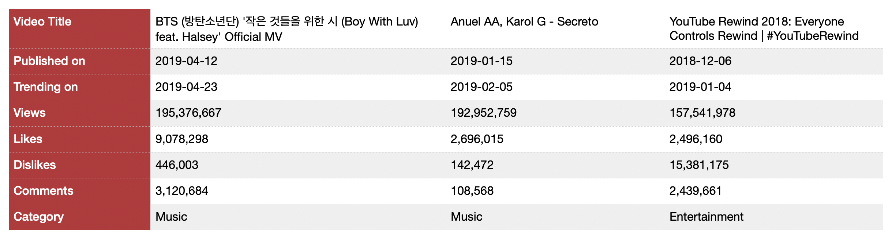

And now we will look at the distribution of views for trending videos. The histogram below shows this distribution:

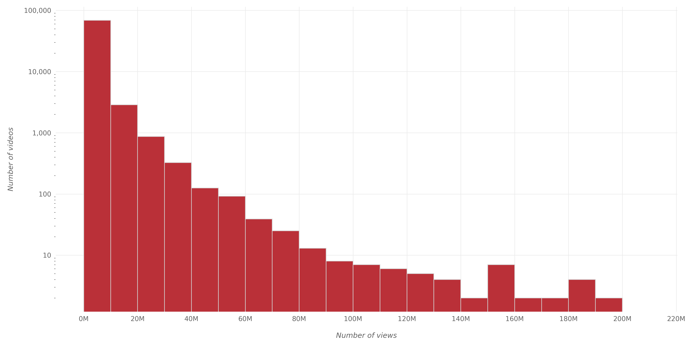

*Notice that the y-axis is [log scaled](https://www.mathsisfun.com/definitions/logarithmic-scale.html). It is 10, 100, 1000... not 10, 20, 30...*

We can see that the vast majority of trending videos had less than 20 million views when they became trending. In fact, when they became trending, around **94% of trending videos had less than 10 million views** and around 99.9% had less than 100 million views.

Now, we might ask: **What are the trending videos with the least amount of views?** The table below shows the 3 trending videos with the lowest number of views when appearing on the trending list:

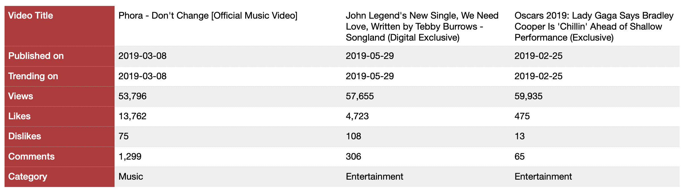

You can see that these three videos appeared on the trending list on the same day they were published on. Maybe they received a high number of views in the first few hours after they were published which sent them to the trending list.

#### How Many Views Videos Had When they First Became Trending?

We mentioned earlier that there were many videos that appeared on the trending list on more than one day. We now want to consider the first appearance only of each video. We want to know how many views a trending video had when it became trending for the first time.

The following graph shows the distribution of the number of views of trending videos when first appearing on the trending list:

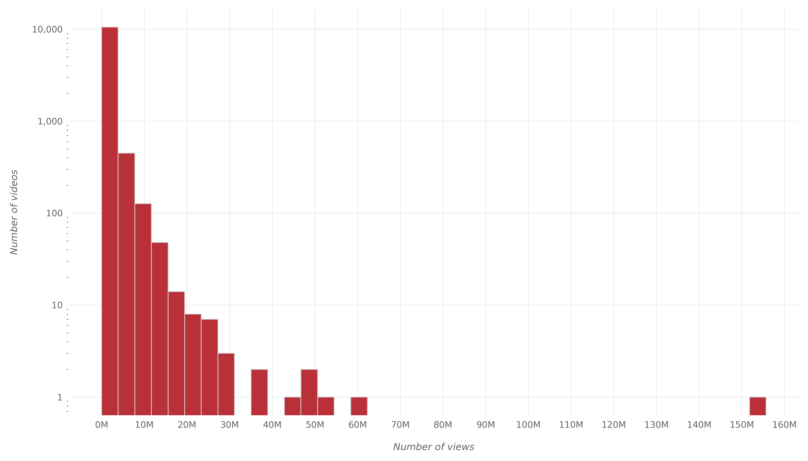

*Notice that the y-axis is [log scaled](https://www.mathsisfun.com/definitions/logarithmic-scale.html). It is 10, 100, 1000... not 10, 20, 30...*

We can see that there is one video that became trending when it had ~150 million views. We can see another one that became trending when it had ~60 million views. But most of the videos became trending when they had less than ~30 million views.

In fact: 

- **90**% of trending videos became trending when they had less than **2,752,317** views. 
- The **minimum** number of views a video had when it became trending was **53,796** views.
- The average number of views a video had when it became trending was **1,387,466** views. The median (the 50th percentile value) was **777,510** views.

### Trending for 30 days!

Some videos don't appear on the trending list for only one day, nor for two days. There are some videos that appeared on the trending list for **30 days**. The following table shows the videos that appeared on the trending list the most. There are 6 videos that appeared for 30 days on the trending list. 

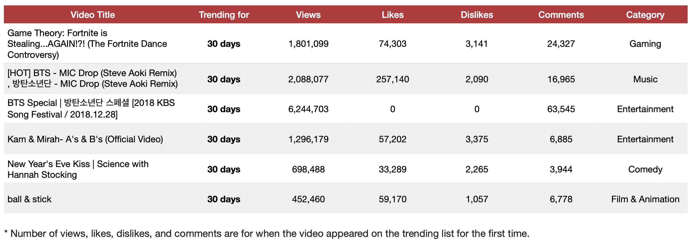

And this is how these videos appear today on YouTube:

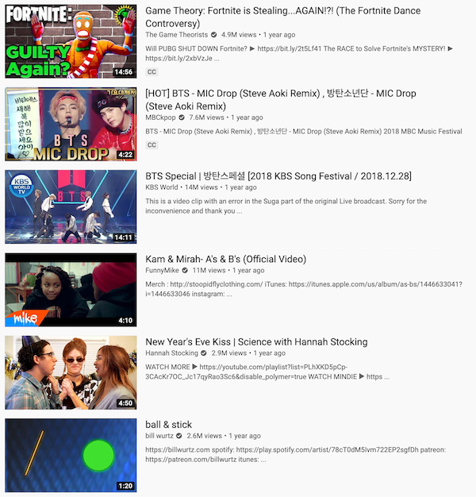

### Trending Videos Titles

Titles constitute an important part of each video. They describe the video for people before deciding to click on the video or not. And because of that, video title is one of the important factors in video success; video title plays an essential role in determining video [click-through-rate](https://creatoracademy.youtube.com/page/lesson/analytics-impressions) (CTR). Here are some interesting facts about 2019's trending-videos titles.

**6% of trending-videos titles are fully uppercase (LIKE THIS)**. Numbers, symbols, and emojis are not taken into account for this. For example, all the following titles are considered fully uppercase: "FIRST TITLE", "2ND TITLE", "#3 TITLE 🎉".

Now if we consider only unique videos (because as you know now, some videos appear more than once on the trending list), we find that **5.3%** of the videos have fully uppercase titles. 

#### Number of Fully-Uppercase Words in Titles

If we count the number of fully-uppercase words in each of the trending-videos titles we get the following distribution graph:

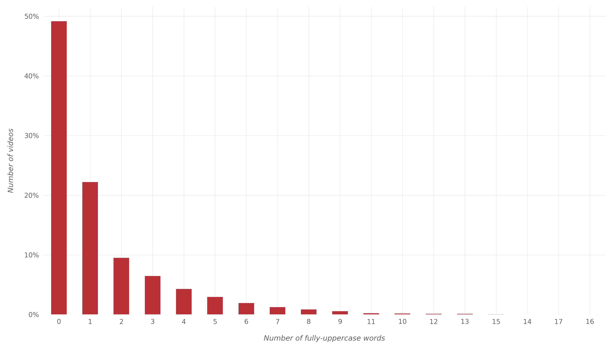

This means that around 50% of trending videos have no fully-uppercase word in their titles, around 20% have 1 fully-uppercase word in their titles, around 10% have 2 fully-uppercase words in their titles, etc.

#### What are the Most Common Words in Video Titles?

Are there some words that occur in trending video titles more than others? To find out the answer, I analyzed the titles of all trending videos and counted the occurrence of each word in those titles.  Before that, symbols were removed from the words and contractions were replaced with their expansions. For example, "aren't" and "we'll" were replaced with "are not" and "we will" respectively. 

Here is a word cloud of the most common 100 words in the trending titles. The size of the word reflects how common it is:

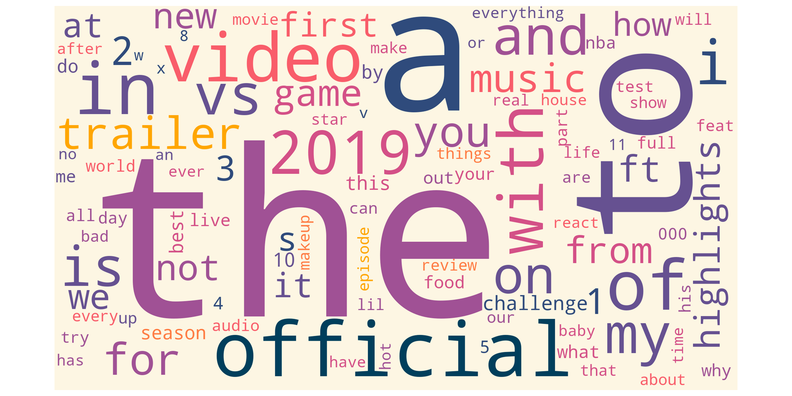

You can see that the most common word is "the" because it is the largest. You can also see large "a", "to", and "in". Such words are called [stop words](https://en.wikipedia.org/wiki/Stop_words). Stop words are words that are very common in a given language (English in our case). To get better results, we will exclude stop words from our analysis.

After excluding stop words, we get this word cloud:

We can now see more meaningfully the most common words in trending-videos titles. To see the exact commonness (frequency) values, the following table shows the most common 15 words with their frequency:

> For more details on the process, method used for word tokenization, stop words specifications, etc., please review the code in the project notebook.

Now let's see what are the **most common symbols** in the titles of trending videos. Previously, we ignored symbols to produce the word clouds above. Now, we will consider only symbols. (XXcontraction expansions still hold true). The table below shows the most common symbols:

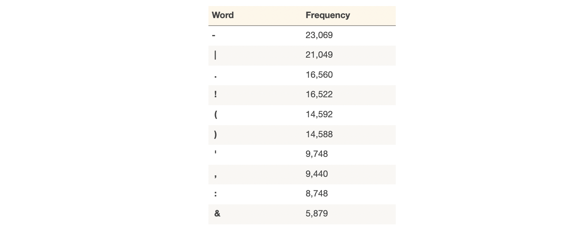

We can see that "**-**" is the most occurring symbol. It occurred around **23,000** times in trending titles. After that comes the pipe "|" which occurred around 21,000 times in trending titles. Then we find "." which occurred 16,560 time. 

Now considering only emoji symbols, let's see the **most common emojis** in the titles of trending videos:

So 🔥 is the most common with frequency of 154 followed by ™️ then ®.

#### What are the Most Common 2-Grams in Video Titles?

But first, what are 2-grams? A 2-gram is a sequence of 2 words. For example, if we have the following sentence: "How are you today?", then we can extract three 2-grams out of it: "How are", "are you", "you today?".

If we extract the 2-grams from all trending-videos titles, what will be the most common ones? The word cloud below answers this question. Notice that the words of each 2-gram are connected with a "-". XXstop-words-and...

And the following table shows the exact frequencies of the 5 most-common 2-grams:

In the word cloud, we can identify some trends: we can see "reacts to", "react to", "avenger endgame", "star wars", "anwar jibawi", etc.

#### Titles Lengths

How long are trending-videos titles? The following box plot answers this question by showing the distribution of titles lengths.

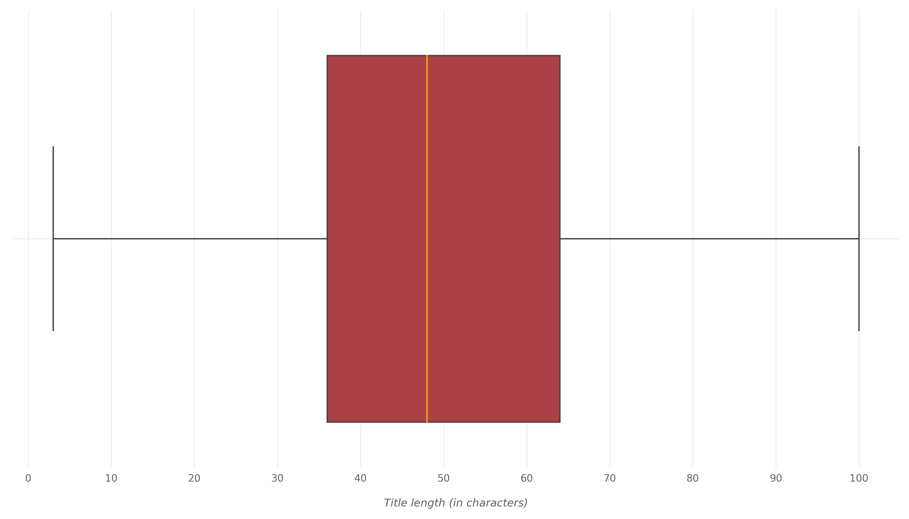

We can see that most trending videos have a title length between 36 and 64 characters. The average title length is 51 characters. The maximum title length is 100 which is the maximum title limit on YouTube and the minimum title length is 3. There is, actually, one video with a title length of 3 which is this video titled "DHL" which appeared on the trending list for 7 days:

### Trending Channels 

Which channels produced more trending videos? The following bar chart tells us the answer:

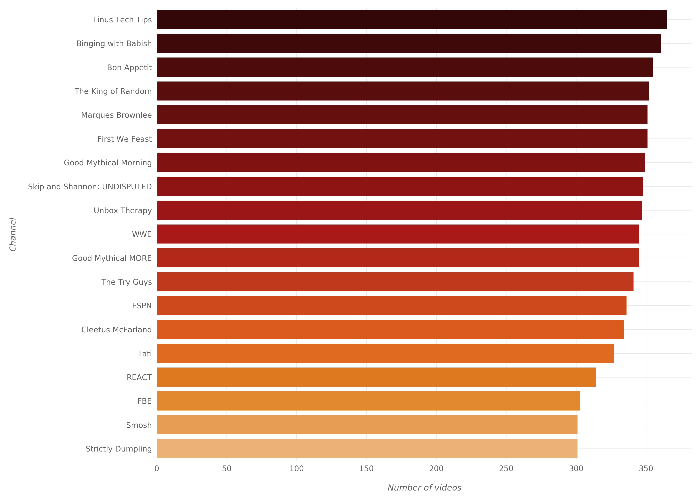

We can see that [Linus Tech Tips](https://www.youtube.com/user/LinusTechTips/?source=ammar-alyousfi) is the channel with most trending videos (365 videos). And the surprise is that it is a technology channel! This channel started in 2008 and has now (22/June/2020) 5,018 published videos. This is how it looks now:

And these are their most popular videos as of now:

And this is how [their first video](https://www.youtube.com/watch?v=zGJSFTaFJbQ) looked like back in 2008:

The second channel with most trending videos is [Binging with Babish](https://www.youtube.com/user/bgfilms) with 361 trending videos. This channel started in 2006 and has now 311 published videos. This is how it looks now:

And these are their most popular videos as of now:

And this is how [their first video](https://www.youtube.com/watch?v=RwGfqexvlts) looked like back in 2007:

And finally, the third top channel in the number of trending videos is [Bon Appétit](https://www.youtube.com/user/BonAppetitDotCom/featured) with 355 trending videos. This channel started back in 2008 and has now 1,149 published videos. This is how the channel page looks like now:

And these are their most popular videos as of now:

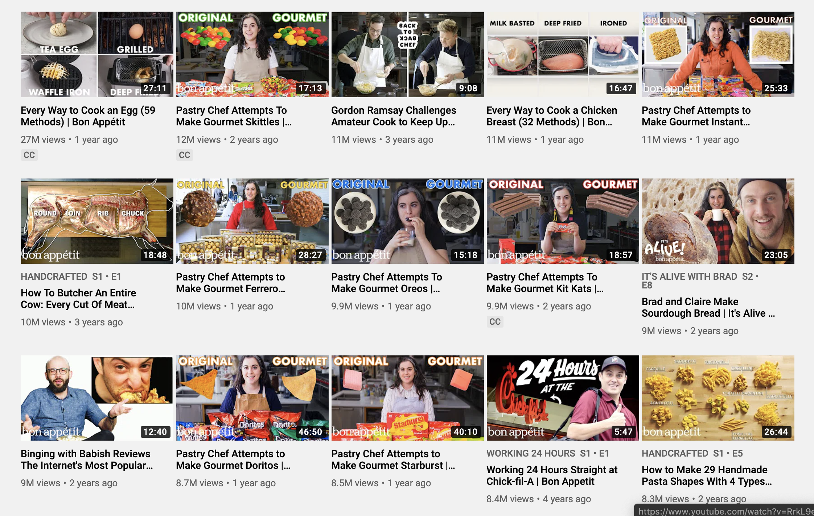

And this is their [first video](https://www.youtube.com/watch?v=9dJ1ZTS_rv8) published in 2012:

### Trending-Videos Categories

YouTube groups videos into categories. Example categories are: Entertainment, Music, Sports, Comedy, Education, etc. The following bar chart shows **the number of trending videos for each category**. The chart doesn't include all categories because there are some categories with no trending videos in 2019.

 

**Entertainment** category comes first with 20,849 trending videos (28.6% of 2019's trending videos). After Entertainment comes **Music** category with 10,236 trending videos (14% of 2019's trending videos). Then at the third place comes **Sports** category with 7,565 trending videos (10.4% of 2019's trending videos).

Looking at this graph gives an idea on what types of videos appear on the trending list more than others. 

### When were Trending Videos Published?

Were there more trending videos published on Saturday more than Monday? Were there more trending videos published in the evening more than the morning? Let's answer these questions with nice visualizations.

> Note: The following two graphs show dates/times in GMT time zone which is now 4 hours ahead of Washington, DC.

The following graph shows the number of trending videos published in every day of the week sorted by the number of videos:

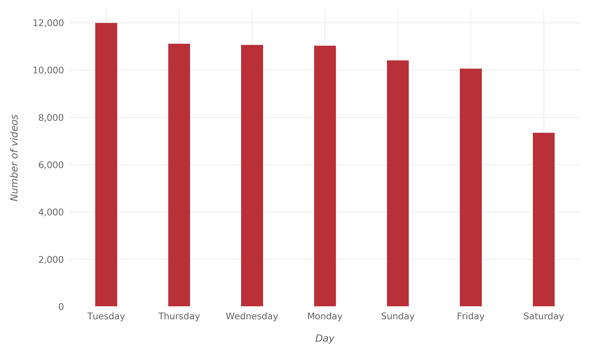

We can see that there were more trending videos published on **Tuesday** (11,986) more than the other days of the week. All other days of the week except Saturday are not far behind Tuesday. For Saturday, there were 7,345 trending videos published on it.

The following graph shows the number of trending videos published in every hour of the day starting with 0 which represents 12 AM and ending with 23 which represents 11 PM:

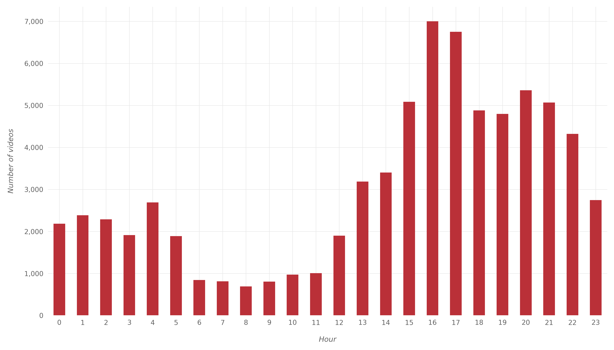

We can see that the peak hours for publishing trending videos were between 16 and 18 (i.e. between 4 PM and 6 PM). If we translate this to Washington time (with daylight saving time in effect), we see that the peak hours were **between 12 PM and 2 PM Washington time**.

We can also see that much fewer trending videos were published between 6 and 11 (i.e. between 6 AM and 11 AM) which is between 2 AM and 7 AM in Washington time (with daylight saving time in effect).

The two graphs above don't *necessarily* mean that videos published on Tuesday have higher chances of becoming trending because Tuesday might be the day that witnessed more uploaded videos in general than other days. So we need to know the number of all videos (not just trending videos) that were published on each day of the week in 2019 to be able to make such claims. The same applies for hours of the day as well.

### Trending Comments

How many comments trending videos have? The histogram below answers this question by showing the distribution of the number of comments for our trending videos:

We can see that the vast majority of trending videos have less than 100,000 comments. More precisely, 98.7% of trending videos have less than 100,000 comments and 90% of trending videos have less than 23,926 comments.

We can notice that there are some videos with huge numbers of comments: we see one video with ~3,100,000 comments; we also see other few videos with numbers of comments ranging between 600,000 and 3,100,000.

The table below shows the top 3 trending videos based on the number of comments:

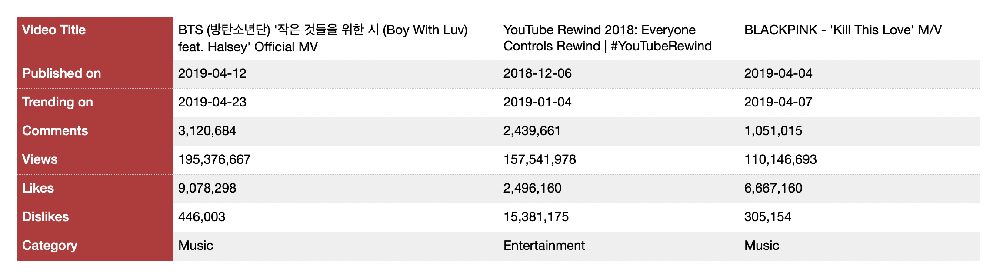

We can see that "Boy With Luv" song by BTS band had the largest number of comments (3,120,684). We saw previously that this song had the largest number of views as well. After this song comes YouTube Rewind 2018 video with 2,439,661 comments then "Kill This Love" song by BLACKPINK band with 1,051,015 comments.

#### How Many Comments Videos Had When they First Became Trending?

Like we did with the number of views, we will see the number of comments videos have when whey appear on the trending list for the first time. The following graph shows us that:

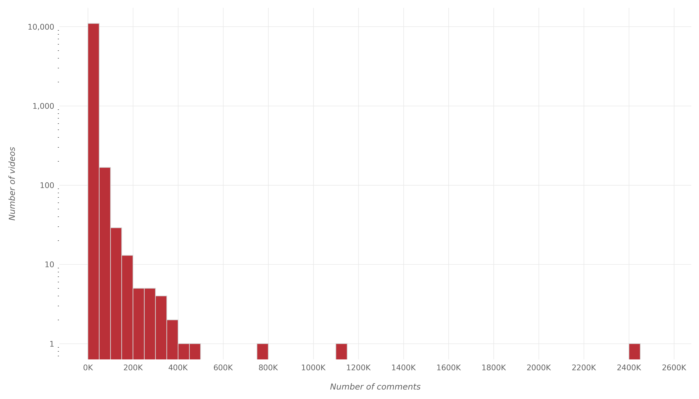

We can see that the vast majority of videos had less than 50,000 comments when they first appeared on the trending list. In fact: 

- **90**% of trending videos became trending when they had less than **14,485** comments. 
- The **minimum** number of comments a [video](https://www.youtube.com/watch?v=l_VzDEr_xx0) had when it became trending was **7** comments only. 
- The average number of comments a video had when it became trending was **7,718** comments. The median (the 50th percentile value) was **3,056** comments.

### Trending, Likes, and Dislikes

Similar to what we did with views and comments, we want to see the distribution of the number of likes/dislikes of trending videos. The histogram below shows the likes distribution:

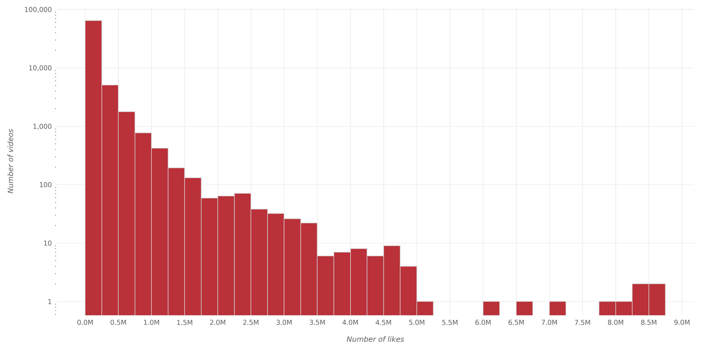

95% of trending videos have less than 500,000 likes and 72.4% have less than 100,000 likes.

The table below shows the 3 most liked trending videos in 2019:

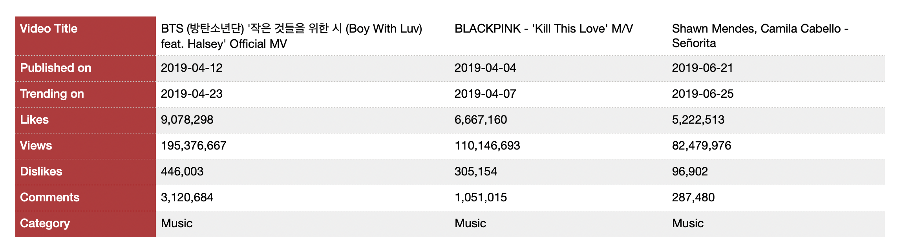

Then we move to dislikes. This histogram shows the distribution of dislikes of our trending videos:

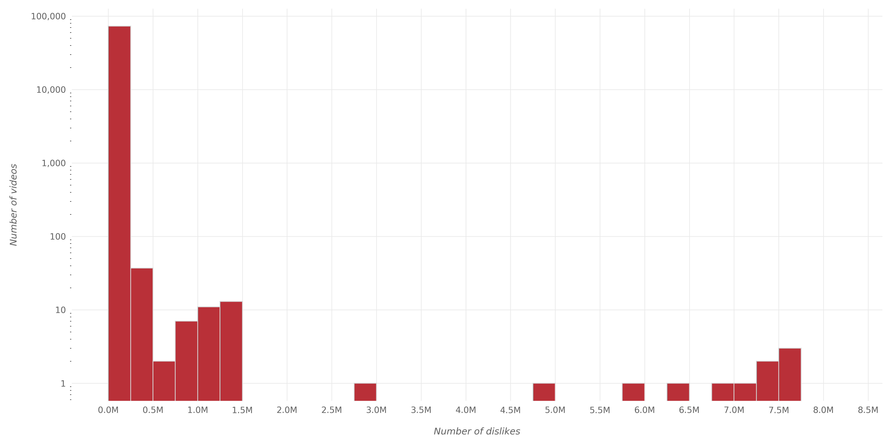

99.4% of trending videos have less than 100,000 dislikes and 91.5% have less than 10,000 dislikes.

The following table shows the 3 most disliked trending videos:

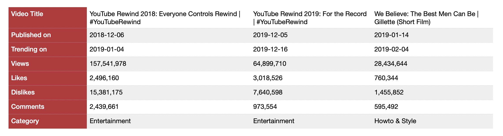

We can see that YouTube Rewind videos of 2018 and 2019 are the two most disliked trending videos in 2019. Note that the number of dislikes for the three videos in the table is larger than the number of likes but they became trending despite that.

And although "Boy With Luv" song was the most liked trending video as we saw above, it is also the 5th most disliked video with 446,003 dislikes.

### How Long Does it Take a Video to Become Trending?

In other words, how many days are between publishing a video and its appearance on the trending list? The box plot below can answer this question:

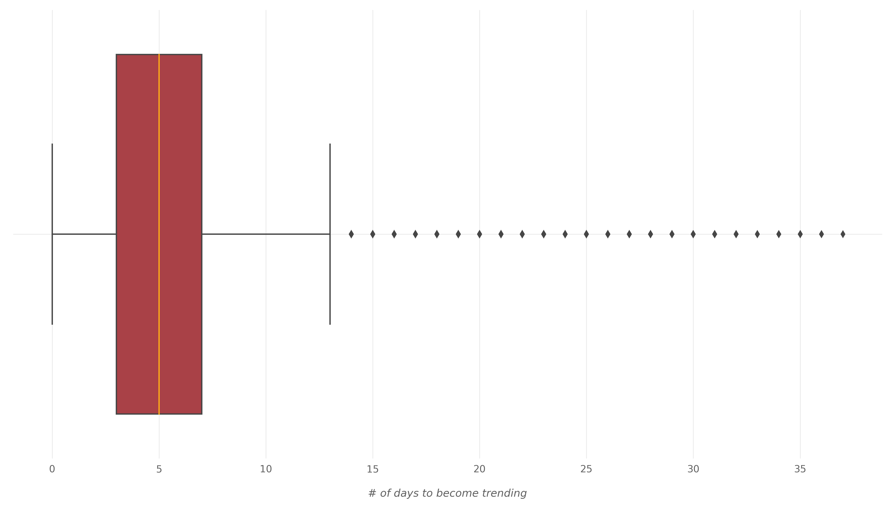

On average, a video appears on the trending list after 5.6 days of publishing it. Also, 95% of the videos took less than 13 days to appear on the trending list. We can also see that there were some videos that appeared on the trending list in less than a day.

Now if we consider only the first appearance of a video on the trending list, we get this box plot:

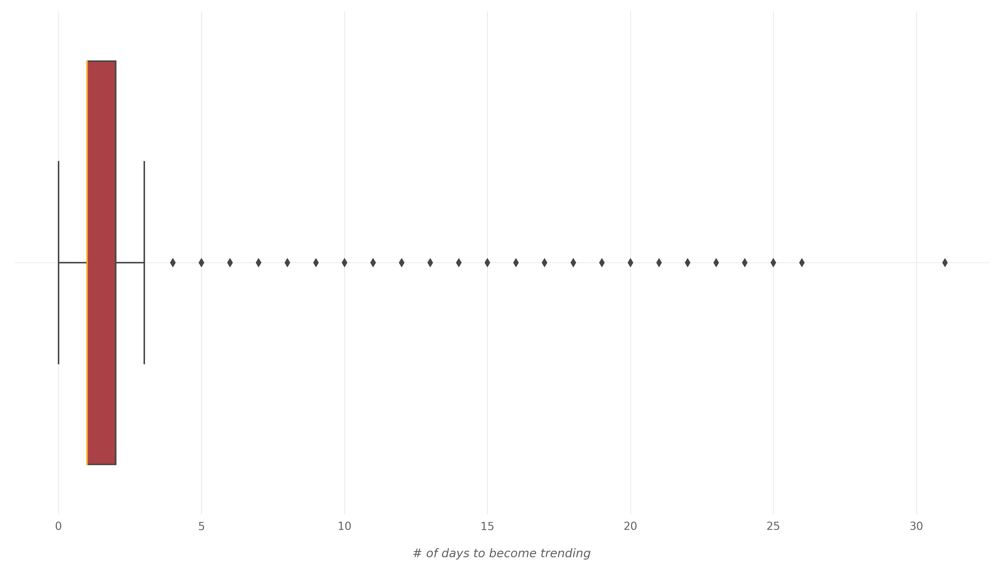

In this case, the video takes on average 1.5 days to become trending. And 97% of the videos appeared on the trending list in less than 2 days after they were published. 

### Trending Descriptions

#### How Long is the Description?

We know that each YouTube video can have a description and that the maximum length of the description is 5,000 characters. Now we ask: How long are the descriptions of trending videos? The box plot below tells us the answer:

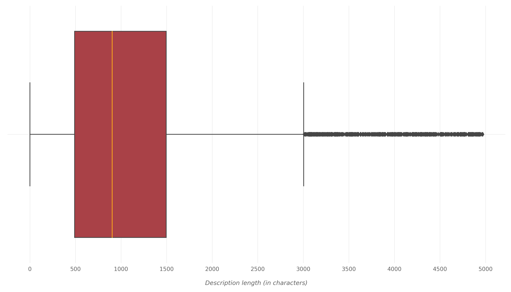

Here are some facts about trending videos descriptions:

- The average description length is 1,129 characters
- Only 281 videos had no description
- 95% of the videos had less than 2,875 characters in their descriptions

#### Most Common Words in Trending Videos Descriptions

The following word cloud shows the most common words in the descriptions of trending videos similar to what was done for video titles. This word cloud shows the most common 100 words after excluding stop words and after expanding the contractions (See the titles section above for the meaning of that).

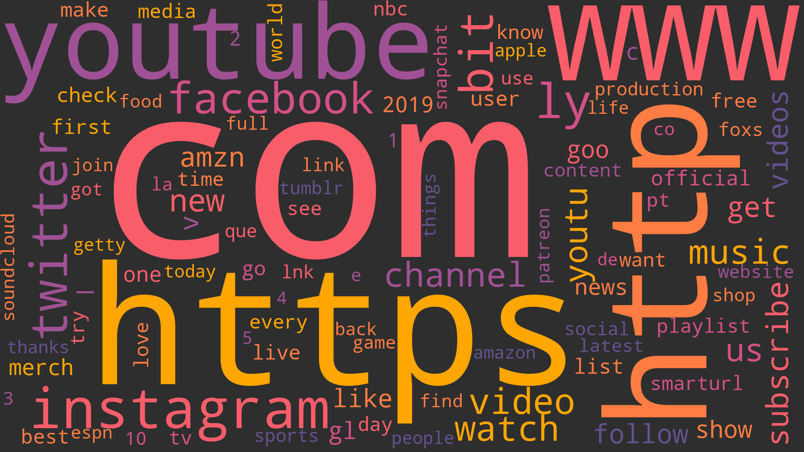

We can see that "https", "http", "com", and "www" are among the most common words. This indicates that trending videos descriptions contain many URLs. We also can see that names of social media platforms like "instagram", "twitter", and "facebook" are quite common also. This indicates that trending videos descriptions contain links to these platforms.

The following table shows the 10 most common words in t he descriptions of trending videos with their exact frequency:

And the following word cloud shows the most common 2-grams in trending videos descriptions (Again, see the titles section above for the meaning of 2-grams):

XX

We can see that

The following table shows the 10 most common 2-grams in the descriptions of trending videos with their exact frequency:

### Trending Tags

When you upload a video to YouTube, you can add tags to the video. Tags are not displayed on the video page; you can see them by viewing the source code of the page or by using browser extensions such as [TubeBuddy](https://www.tubebuddy.com/) and [vidIQ](https://vidiq.com/). There is a lot of debate on whether tags affect how YouTube algorithm deals with the video. Does adding effective tags make the algorithm show the video to more people on YouTube? Do tags affect where a video appears in the search results? No one knows certainly. When you upload a video, you find this written above the tag section:

> Tags can be useful if content in your video is commonly misspelled. Otherwise, tags play a minimal role in helping viewers find your video.

But if that was true, why would YouTube add a lot of tags to their videos? For example, YouTube Rewind video of 2019 has all of these tags:

> Rewind, Rewind 2019, youtube rewind 2019, #YouTubeRewind, MrBeast, PewDiePie, James Charles, Shane Dawson, CaseyNeistat, RiceGum, Simone Giertz, JennaMarbles, Lilly Singh, emma chamberlain, The Try Guys, Fortnite, Minecraft, Roblox, Marshmello, Garena Free Fire, GTA V, Lachlan, Anaysa, jeffreestar, Noah Schnapp, Jennelle Eliana, T-Series, Azzyland, LazarBeam, Dude Perfect, David Dobrik, KSI, NikkieTutorials, Kurzgesagt, Jelly, Ariana Grande, Billie Eilish, BLACKPINK, Year in Review

Apart from this discussion, this following violin plot shows the distribution of the number of tags in trending videos. This plot lets us know how many tags trending videos have:

